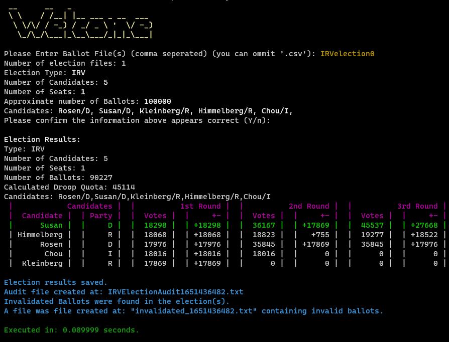
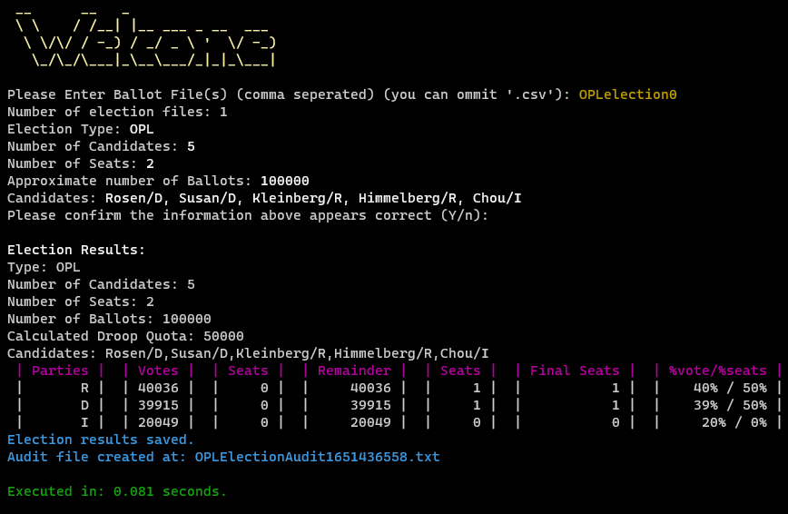
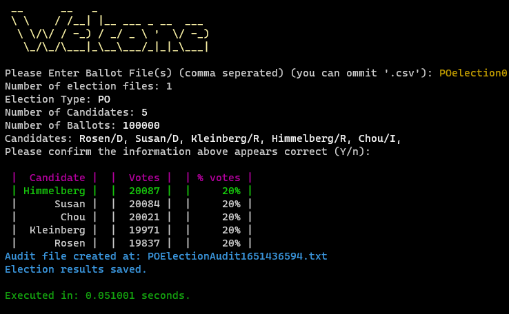
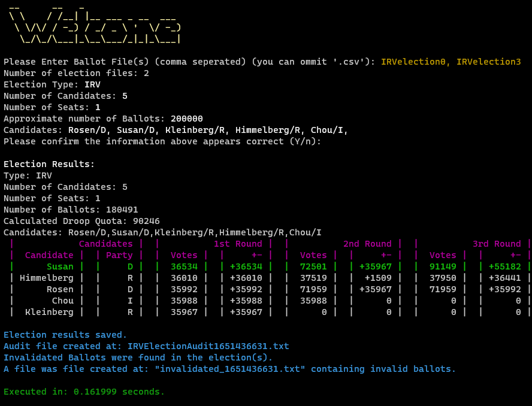

# Project #2: Agile Scrum

### Team Members: Haneesha Kella, Charlie Nazarian, Caleb Venkatrathnam, Tanner Jack

### x500s: kella458, nazar077, venka147, jack1681

## Description of Project:
From Project 1, our team project was able to create a stand-alone voting system that can perform Instant Runoff Voting (IRV) and Open Party List (OPL) Voting by following the Waterfall methodology. Project 1 implemented the plurality/majority and proportional voting systems through Instant Runoff Voting and Open Party List Voting with the utilization of the C++ language.  
In this project, some implementation and changes are made to Project 1 to add new functionality to the existing system. The scope of the product is to further utilize the software to streamline the election  process for election officials, automating the counting process and counting style based on the selected voting system (IRV or OPL). However, the approach utilized in this project is Agile Scrum by using one 2-weeks sprint.  In this improved software, the product will continue to have fully functioning IRV and Open Party Listing algorithms. In addition to the exisiting algorithms, this improved system will include the Popularity Only (PO) voting algorithm. This product will also have a new functionality by brining in multiple files from different ballot locations, instead of a singular file in Project 1. Furthmore, this improved system will handle the process of invalidated ballots for IRV if at least half of the candidates are not ranked. This software will continue to save time and reduce the number of people needed to count votes. It will also provide an audit file so that an election can be replicated if desired.

A makefile is in the src directory to compile all the related the files of the project. To run the makefile, go to the src directory of this project repo. 
Then, type "make all" in the terminal. After running the project, type "make clean" to clear any object files.

Just like Project 1, the google testing framework was used to verify the different functionality of the methods and classes present within this project system. 
Each method was tested to verify the unit testing of the methods. In addition, system testing was inclulded in IPV_test.cpp, OPL_test.cpp, POTest.cpp, InvalidateballotsTest.cpp, and multuplefilestest.cpp to verify the overall functionality of the system. Sample election files were passed in to these programs to verify the correctness of the classes. These sample files can also found in the testing directory.

The doxygen genereted html file is under the documentation folder. It is titled "index.html".

## How to
* Run the command `make all`
* Run the generated exe `all`
* To disable shuffle, run `all -S` instead to run the election
* Enter your election file name ( ten of each election type have been provided, each election if prefixed with its type in all caps to electionX, where X is 0 - 9).
  * Example: "IRVelection2"
* Election file names do not need ".csv" ending, but is still allowed.
* Results and audit file are saved in the same directory

## Issues:
- Testing files are not able to run due to the error within the Election file.
- Multiple seats in IRV messes up results

## Screenshots:
Example screenshots

IRV election example.

OPL election example.

PO election example.

### Multiple Files example

Multiple files example with an IRV election.
